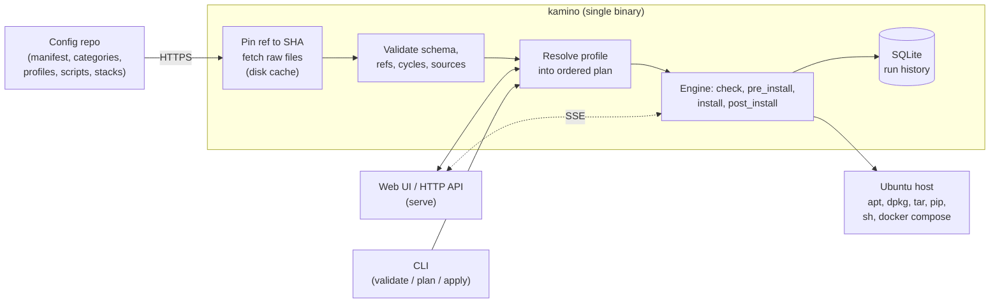

# Kamino

[](https://github.com/t0mer/kamino/releases/latest)
[](go.mod)
[](LICENSE)

Provision a freshly installed Ubuntu server from a versioned config repository:
a single Go binary with an embedded web UI that pulls your configuration over
HTTPS, shows you exactly what it will install, and streams live progress as it
runs.

> The name is a nod to the Star Wars cloning world: point every server at the
> same config repo and they come out identical, every time.

- **One binary, no dependencies.** The React UI is embedded via `go:embed`; state
  lives in a pure-Go SQLite database (`CGO_ENABLED=0`). Download it, run it.
- **Your config, your repo.** Kamino ships with no configuration baked in. You
  point it at a repo you control (GitHub, GitLab, or any other HTTPS host that
  serves raw files) and it treats that repo as read-only truth.
- **No git, no clone.** Config files are fetched as raw content over HTTPS on
  demand and pinned to a single commit SHA for the run, so a mid-run push can't
  produce a half-old, half-new plan.
- **You see everything first.** The plan lists every step (ref, name, version,
  type), every `pre_install` / `post_install` command in the CLI, and warns about
  every `script` and compose stack that will run as root, before you start.

---

## Table of contents

- [Features](#features)
- [How it works](#how-it-works)
- [Requirements](#requirements)
- [Install](#install)
- [First run](#first-run)
- [Command-line usage](#command-line-usage)
  - [Commands](#commands)
  - [Flags](#flags)
  - [Environment variables and precedence](#environment-variables-and-precedence)
  - [Files in the data directory](#files-in-the-data-directory)
  - [Exit codes](#exit-codes)
  - [Logging](#logging)
- [The config repository](#the-config-repository)
  - [Layout](#layout)
  - [Supported hosts](#supported-hosts)
  - [manifest.yaml](#manifestyaml)
  - [Categories and items](#categories-and-items)
  - [Item types](#item-types)
  - [Profiles](#profiles)
  - [Templating](#templating)
  - [Validation rules](#validation-rules)
  - [Plan resolution and ordering](#plan-resolution-and-ordering)
  - [Complete example](#complete-example)
- [Run execution](#run-execution)
- [Secrets](#secrets)
- [HTTP API (serve mode)](#http-api-serve-mode)
- [Metrics](#metrics)
- [Security and trust model](#security-and-trust-model)
- [Troubleshooting](#troubleshooting)
- [Screenshots](#screenshots)
- [Building from source](#building-from-source)
- [Contributing](#contributing)
- [License](#license)

---

## Features

- **Seven working installers:** `apt` (with an optional PPA/repository), `deb`,
  `tarball`, `binary`, `pip`, `script`, and `compose_stack`. The schema also
  accepts `snap`, but no snap installer exists yet (see
  [Item types](#item-types)).
- **Profiles** select items by exact ref or `category/*` wildcard, can exclude
  items, and can override versions.
- **Dependency graph:** `depends_on` pulls missing dependencies into the plan
  automatically, rejects cycles, and orders steps deterministically.
- **Idempotent runs:** each item's `check` / `check_contains` probe runs first,
  and an item that is already installed is skipped.
- **Per-architecture sources** (`amd64` / `arm64`) with optional SHA-256
  verification of every download.
- **Secrets** are declared by name in the repo, supplied at run time, held in
  memory only, and redacted from logs.
- **Web UI** (Connect, Setup, Run, History screens; light and dark theme) with
  live progress over Server-Sent Events.
- **Headless CLI** (`validate`, `plan`, `apply`) for cloud-init or SSH bootstraps.
- **Run history** in SQLite: status, config SHA, and per-step status and logs.
- **Cached config fallback:** fetched config files are cached on disk. If a raw
  file fetch fails (other than a 404) and that exact file was fetched before at
  the same pinned SHA or ref, the cached copy is served with a "stale config"
  warning.
- **Prometheus metrics** at `/metrics`.

---

## How it works



1. You tell Kamino where your config repo is (URL + branch/ref, plus an access
   token for private repos), either in the web UI's **Connect** screen or via
   flags/environment for a headless bootstrap.
2. Kamino resolves the ref to a commit SHA (GitHub and GitLab.com), fetches
   `manifest.yaml` from the repo's raw base URL, and then fetches every
   category/profile file the manifest lists at that SHA. Scripts and
   compose-stack files are fetched lazily, only when a step that needs them runs.
3. You pick a **profile** and Kamino resolves the dependency graph into an
   ordered plan.
4. Each step runs its idempotency `check` first (an already-installed item is
   marked `skipped`); otherwise the matching installer runs with a per-command
   timeout. `pre_install` / `post_install` output is streamed to the UI and
   stored in SQLite line by line.

Kamino runs its installs as **root** (launch it with `sudo`) and targets
**Ubuntu** on **amd64/arm64**. `kamino apply` refuses to run unless the host is
Ubuntu and the process is root, with an actionable error.

---

## Requirements

- **Ubuntu** on `amd64` or `arm64` (release binaries are published for these two
  only).
- **Root** (`sudo`) for `apply`, for installs started from the web UI, and for
  the default data directory `/var/lib/kamino`.
- Outbound **HTTPS** to your config repo host (and, for GitHub/GitLab.com, their
  API to resolve the ref), and to wherever your items download from.
- The host tools your items use: `apt-get` / `add-apt-repository` (`apt`),
  `dpkg` (`deb`), `tar` (`tarball`), `python3` / `python3.X` with pip (`pip`),
  `/bin/sh` (`script`), and `docker compose` (`compose_stack`).
- A config repository you control (see [The config repository](#the-config-repository)).

---

## Install

Binaries are published on the [releases page](https://github.com/t0mer/kamino/releases)
for `linux/amd64` and `linux/arm64`. Grab the archive for your architecture,
extract it, and run it with `sudo`. Each archive contains the `kamino` binary,
`LICENSE`, and `README.md`.

**amd64:**

```bash
wget https://github.com/t0mer/kamino/releases/latest/download/kamino_linux_amd64.tar.gz
tar xzf kamino_linux_amd64.tar.gz
sudo ./kamino serve
```

**arm64:**

```bash
wget https://github.com/t0mer/kamino/releases/latest/download/kamino_linux_arm64.tar.gz
tar xzf kamino_linux_arm64.tar.gz
sudo ./kamino serve
```

Each release also ships a `checksums.txt` (SHA-256). Verify the archive you
downloaded with:

```bash
wget https://github.com/t0mer/kamino/releases/latest/download/checksums.txt
sha256sum -c checksums.txt --ignore-missing
```

There is no Docker image, `.deb`, or other package: the tarball is the only
distribution format.

> **`go install`?** `go install github.com/t0mer/kamino/cmd/kamino@latest`
> compiles, but the web UI is not committed to the repo, so that binary serves
> the API only (it logs `web ui not served`) and reports its version as `dev`.
> Use a release archive or [build from source](#building-from-source) to get
> the UI.

---

## First run

```bash
sudo ./kamino serve
```

Kamino listens on `http://127.0.0.1:8844` by default and prints an **API token**
the first time it runs. The token is stored in `settings.json` in the data dir
and printed only once. Open the UI, paste the token, and:

- On the **Connect** screen, enter your config repo URL, branch (default `main`),
  and, for a private repo, an access token (plus an optional raw base URL
  override for other hosts). Hit **Test connection** to confirm Kamino can reach
  the repo and finds a valid manifest. **Save** runs the same check and refuses
  an invalid repo.
- On the **Setup** screen, review the host card and the config name and commit
  SHA, pick a profile, review the plan and its warnings, and fill in any required
  secrets.
- The **Run** screen streams live progress and can cancel the run. **History**
  keeps the last 50 runs with their config SHA, result, and logs.

To reach the UI from another machine, bind a non-loopback address explicitly
(`--listen 0.0.0.0:8844`). Kamino logs a warning when it does, because the API
installs software as root. Put it behind a firewall or a TLS-terminating
reverse proxy.

For a fully headless bootstrap (cloud-init, SSH), skip the UI entirely:

```bash
sudo ./kamino apply --repo https://github.com/you/your-config --profile production --yes
```

---

## Command-line usage

### Commands

```
kamino serve      # HTTP server + embedded web UI (the main lifecycle)
kamino plan       # resolve a profile into an ordered plan and print it
kamino apply      # run an install headlessly, progress streamed to the terminal
kamino validate   # fetch and validate the config repo
kamino version    # print the version and exit
```

| Command | What it does |
|---|---|
| `serve` | Loads or creates the API token, opens the SQLite DB, and serves the web UI, `/api/v1`, `/healthz` and `/metrics`. Shuts down gracefully on `SIGINT` / `SIGTERM`. |
| `validate` | Fetches the config repo, prints every warning and error, and ends with `<name>: N categories, M profiles, SHA <sha> — OK` when there are no errors. It does not resolve profiles; use `plan` for that. |
| `plan` | Validates, resolves `--profile` for `--arch`, and prints the ordered steps (including every `pre_install` / `post_install` line) and warnings, or JSON with `--json`. |
| `apply` | Validates, builds the plan, checks that every declared secret has a value, then (unless `--dry-run`) prints the warnings, checks for Ubuntu + root, requires `--yes`, and runs the plan. |
| `version` | Prints `kamino <version>` (`kamino dev` for an unversioned build). |

Typical headless commands:

```bash
kamino validate --repo https://github.com/you/your-config
kamino plan     --repo https://github.com/you/your-config --profile dev
kamino plan     --repo https://github.com/you/your-config --profile dev --arch arm64 --json
sudo kamino apply --repo https://github.com/you/your-config --profile dev --dry-run
sudo kamino apply --repo https://github.com/you/your-config --profile dev \
  --secret CF_TUNNEL_TOKEN=... --continue-on-error --yes
```

`apply` has no interactive prompt: without `--yes` it prints what it would run
and exits with an error (`refusing to proceed without --yes`).

### Flags

Persistent flags (available on every subcommand):

| Flag | Default | Purpose |
|---|---|---|
| `--data-dir` | `/var/lib/kamino` | Data directory: SQLite DB, saved settings, offline cache. |
| `--repo` | _(saved setting)_ | Config repo URL (`https://host/owner/repo`). Overrides the value saved through the UI. |
| `--ref` | _(saved setting, else `main`)_ | Config repo branch, tag, or commit SHA. |
| `--token` | – | Access token for a private config repo. |
| `--raw-base` | – | Raw base URL template with `{ref}` and `{path}` placeholders, for hosts other than GitHub and GitLab.com. |
| `--log-level` | `info` | `debug`, `info`, `warning` (or `warn`), or `error`. |
| `--log-format` | `auto` | `json`, `text`, or `auto` (text on a terminal, JSON otherwise). |

`--config-dir <dir>` is a hidden development flag: it reads the config repo from
a local directory instead of fetching it (no network, no ref pinning). The smoke
test uses it.

Command-specific flags:

| Command | Flag | Default | Purpose |
|---|---|---|---|
| `serve` | `--listen` | `127.0.0.1:8844` | Address to bind. Use `0.0.0.0:8844` to expose it. |
| `plan` | `--profile` | – | Profile to resolve (required). |
| `plan` | `--arch` | host arch | Target architecture (`amd64` / `arm64`). |
| `plan` | `--json` | `false` | Emit the plan as JSON. |
| `apply` | `--profile` | – | Profile to apply (required). |
| `apply` | `--arch` | host arch | Target architecture. |
| `apply` | `--continue-on-error` | `false` | Keep going after a failed step; its dependents are marked blocked. |
| `apply` | `--dry-run` | `false` | Print the plan and exit without installing. Needs no root, but must be able to read the data dir: once settings are saved under the default `/var/lib/kamino` (mode `0700`), run it with `sudo`, or pass `--repo` with a writable `--data-dir`. |
| `apply` | `--yes` | `false` | Required to actually run the plan. |
| `apply` | `--verbose` | `false` | Stream captured command output (`pre_install` / `post_install` and the run-level `apt-get update`) to the terminal. |
| `apply` | `--secret` | – | Secret value as `KEY=VALUE` (repeatable). |
| `apply` | `--keep-runs` | `50` | How many past runs to retain in history; `0` prunes every run right after it finishes. |

### Environment variables and precedence

Resolution precedence is **flag → environment → saved setting → default** (a
saved UI value is the normal path; flags and env exist as one-off / headless
overrides). These overrides apply to the CLI commands (`validate`, `plan`,
`apply`) and to the config the server loads for `/api/v1/config`, `/plan` and
`/runs`; the UI's **Connect** screen shows and edits only the saved settings.

| Variable | Equivalent flag | Saved setting (`settings.json`) |
|---|---|---|
| `KAMINO_REPO` | `--repo` | `repo_url` |
| `KAMINO_REF` | `--ref` | `ref` |
| `KAMINO_TOKEN` | `--token` | `token` |
| `KAMINO_RAW_BASE` | `--raw-base` | `raw_base_template` |

Apart from these, Kamino only honours the standard `TMPDIR` (location of the
per-run temp directory and of the settings-test cache). Secrets are passed with `--secret`
(CLI) or in the run request (UI/API), not through the environment.

### Files in the data directory

| Path | Contents |
|---|---|
| `<data-dir>/settings.json` | Saved repo URL, ref, repo token, raw base template, and the API token. Written atomically with mode `0600`. |
| `<data-dir>/kamino.db` | SQLite run history: runs, steps, and captured log lines. |
| `<data-dir>/cache/<pinned-sha-or-ref>/<path>` | Last fetched copy of each config file, used as the stale fallback. The directory is the pinned commit SHA on GitHub/GitLab.com, and the literal ref (e.g. `main`) on `--raw-base` hosts. |

Downloaded artifacts, fetched scripts, and compose files are written to a
per-run temp directory (`kamino-run-*` under `$TMPDIR`) that is removed when the
run ends.

### Exit codes

| Code | Meaning |
|---|---|
| `0` | Success. For `apply`, every step ended `success` or `skipped` (or `--dry-run` printed the plan). |
| `1` | Any error, printed as `error: …` on stderr: bad flags, no repo configured, fetch or validation failure, unknown profile, missing secrets, not Ubuntu/root, missing `--yes`, or a run that finished `failed` / `cancelled`. |

### Logging

Diagnostics go to **stderr** through Go's `log/slog`; plan and progress output
goes to **stdout**, so `plan --json` and `apply --dry-run` stay script-friendly.
`--log-format auto` picks text when stderr is a terminal and JSON otherwise (for
example under cloud-init or systemd).

---

## The config repository

Kamino is driven entirely by a config repo you own. `t0mer/kamino-config` is a
reference example you can fork; the app has **no** repo baked in.

### Layout

```
your-config/
├── manifest.yaml            # entry point: schema version, defaults, file index
├── categories/*.yaml        # installable items grouped by category
├── profiles/*.yaml          # named selections of items, with version overrides
├── stacks/                  # optional docker-compose stacks
└── scripts/                 # custom install scripts referenced by items
```

Only `manifest.yaml` has a fixed path. Category and profile files are whatever
paths the manifest lists. All YAML is decoded strictly: an unknown field is an
error, so typos are reported instead of silently ignored.

The **Required** columns below reflect the JSON Schema in [`schema/`](schema/).
`kamino validate` does not check them all: it enforces only the rules listed
under [Validation rules](#validation-rules) (for example, a missing item `name`
or profile `id` is not reported by `validate`). Run the JSON Schema in your
config repo's CI to catch the rest.

A JSON Schema for these files lives under [`schema/`](schema/)
([`manifest`](schema/manifest.schema.json), [`category`](schema/category.schema.json),
[`profile`](schema/profile.schema.json)), so your config repo can validate
itself in CI.

### Supported hosts

The repo URL must be `https://` with an `owner/repo` path.

| Host | Raw file URL | Ref pinned to a SHA via | Auth header (with a token) |
|---|---|---|---|
| `github.com` | `https://raw.githubusercontent.com/<owner>/<repo>/<sha>/<path>` | GitHub commits API | `Authorization: token <token>` |
| `gitlab.com` | `https://gitlab.com/<owner>/<repo>/-/raw/<sha>/<path>` | GitLab commits API | `PRIVATE-TOKEN: <token>` |
| Anything else (self-hosted GitLab, Gitea/Forgejo, …) | `--raw-base` template, **required** | not pinned: the ref is used as given | `Authorization: Bearer <token>` |

A raw base template must contain both `{ref}` and `{path}`; the owner and repo
must be written into it literally. For example, for a Gitea/Forgejo host:

```bash
kamino validate \
  --repo https://git.example.com/you/your-config \
  --raw-base 'https://git.example.com/you/your-config/raw/branch/{ref}/{path}'
```

For hosts without SHA pinning, pass a commit SHA as `--ref` if you need the same
guarantee that a mid-run push can't change the plan.

Config files are capped at 10 MiB each. The auth header is dropped on a
redirect to a different host.

### manifest.yaml

| Field | Type | Required | Description |
|---|---|---|---|
| `schema` | int | yes | Must be `1`. |
| `name` | string | yes | Display name, shown in the UI and CLI output. |
| `defaults.apt_update_before_run` | bool | no | Run `apt-get update` once before the first step. |
| `defaults.timeout` | duration | no | Default per-command timeout (e.g. `15m`). Falls back to `15m`. |
| `categories` | list of paths | yes | Category files to load, relative to the repo root. |
| `profiles` | list of paths | no | Profile files to load. |

### Categories and items

A category file:

| Field | Type | Required | Description |
|---|---|---|---|
| `id` | string | yes | Category id, the first half of every item ref. |
| `name` | string | yes | Display name. |
| `order` | int | no | Sort key. Lower categories come first in the plan. |
| `items` | list | yes | The installable items. |

Every item is addressed by its **ref**, `<category id>/<item id>` (for example
`tools/jq`). Item fields:

| Field | Applies to | Description |
|---|---|---|
| `id` | all (required) | Item id. It is also used as a file/directory name (install dir, binary name, script name, compose project), so keep it to `a-z`, `0-9` and `-`, as the JSON Schema requires. |
| `name` | all (required) | Display name. |
| `type` | all (required) | `apt`, `deb`, `tarball`, `binary`, `pip`, `script`, `compose_stack` (or `snap`, see below). |
| `version` | all | Free-form version, substituted into `{version}` placeholders. A profile can override it. |
| `source` | `deb`, `tarball`, `binary`, `script` | Download URL. Either one string (used for every arch) or a map `amd64: …` / `arm64: …`. Must be `https://`; a `script` may also use a repo-relative path. |
| `sha256` | `deb`, `tarball`, `binary`, `script` (https) | Expected SHA-256 of the download: one string or a per-arch map. Verified when present. |
| `packages` | `apt`, `pip`, `snap` (required) | Package names. |
| `repo` | `apt` | Repository/PPA passed to `add-apt-repository -y`, followed by `apt-get update`. |
| `python` | `pip` | Interpreter version suffix: `"3.12"` runs `python3.12 -m pip`. Default `python3`. |
| `install_dir` | `tarball` | Directory to extract into. Default `/usr/local`. |
| `path_export` | `tarball` | Directory to add to `PATH` via `/etc/profile.d/kamino-<id>.sh`. |
| `path` | `binary`, `compose_stack` | `binary`: absolute install path (default `/usr/local/bin/<id>`). `compose_stack`: repo directory holding the stack files (required). |
| `files` | `compose_stack` (required) | Files under `path` to fetch. One must be `docker-compose.y(a)ml` or `compose.y(a)ml`. |
| `env_file` | – | Accepted by the parser but not used by any installer. The JSON Schema describes it as a "Marker that a compose_stack consumes secret env vars"; secrets reach compose through `secrets` either way. |
| `depends_on` | all | Refs (`category/item`) that must be installed first. |
| `check` | all | Shell command (`/bin/sh -c`). Exit code 0 means already installed, so the step is skipped. Without a `check`, the item is always installed. |
| `check_contains` | all | Also require this substring in the `check` output. Requires `check`. |
| `pre_install` | all | Shell lines run before the installer. |
| `post_install` | all | Shell lines run after the installer. |
| `timeout` | all | Per-command timeout (Go duration, e.g. `10m`). Overrides `defaults.timeout`. |
| `arch` | all | Restrict the item to these architectures (`amd64`, `arm64`). Empty means all. |
| `secrets` | all | Secret names this item needs (see [Secrets](#secrets)). |

### Item types

| Type | What the installer does |
|---|---|
| `apt` | Optional `add-apt-repository -y <repo>` + `apt-get update`, then `apt-get install -y -- <packages>` with `DEBIAN_FRONTEND=noninteractive`. |
| `deb` | Downloads `source` (verifying `sha256`), `dpkg -i`, then `apt-get install -f -y` to pull in dependencies. |
| `tarball` | Downloads a `.tar.gz` (verifying `sha256`), **deletes `<install_dir>/<id>`**, extracts with `tar -C <install_dir> -xzf`, and optionally writes the `PATH` export. The archive should unpack into a top-level `<id>/` directory (like the Go tarball does into `go/`). |
| `binary` | Downloads `source` (verifying `sha256`), `chmod 0755`, and moves it to `path`. |
| `pip` | `python3[.X] -m pip install --break-system-packages <packages>`. |
| `script` | Fetches the script from an `https://` URL (verifying `sha256`) or from a repo-relative path at the pinned SHA, and runs it with `/bin/sh`. |
| `compose_stack` | Fetches `path/<files>` from the repo into the run temp dir and runs `docker compose -p <id> -f <compose file> up -d`. Each declared secret is passed to compose as an environment variable of the same name. |
| `snap` | Accepted by validation, but there is no snap installer yet: the step fails with `no runner for item type "snap"`. |

### Profiles

| Field | Type | Required | Description |
|---|---|---|---|
| `id` | string | yes | Profile id, used by `--profile` and the UI. |
| `name` | string | yes | Display name. |
| `include` | list of patterns | no | Exact refs (`tools/jq`) or `category/*` wildcards. A profile with no includes resolves to an empty plan. |
| `exclude` | list of patterns | no | Same pattern syntax. An exclude beats an include. |
| `overrides` | map of ref → `{version: …}` | no | Replace an item's `version` for this profile. |

A pattern that matches no item is an error (it is almost always a typo).

### Templating

- `{version}` is replaced with the item's (possibly overridden) version.
- `{secret:NAME}` is replaced with the secret's value at run time.

Both are expanded in `source`, `check`, `check_contains`, `packages`,
`pre_install` and `post_install`. Other fields are used literally.

### Validation rules

Loading happens first: a file that fails to fetch or to decode (bad YAML, or an
unknown field under strict decoding) stops loading at the **first** such file
with a single error. Once every file loads, `kamino validate` (and every `plan`,
`apply`, and settings save) reports **all** remaining problems at once. Errors:

- `schema` is not `1`.
- Duplicate category ids, or duplicate item ids within a category.
- Unknown `type`.
- `apt`, `pip` or `snap` without `packages`.
- `compose_stack` without `path` or `files`, or with no `docker-compose.y(a)ml` /
  `compose.y(a)ml` among the files.
- `check_contains` without `check`.
- `deb`, `tarball` or `binary` missing a `source` for any architecture the item
  supports.
- A `source` that is not `https://` (a `script` may use a relative repo path
  instead, but not an absolute one or one containing `..`).
- `depends_on` pointing at an unknown ref, or a dependency cycle (reported once,
  with its path).

Warnings (the run is still allowed):

- `deb`, `tarball` or `binary` without a `sha256` for an architecture: the
  download will not be verified.

Profile patterns, excludes, and architecture support are checked when a plan is
built (`plan`, `apply`, or the UI's plan review), not by `validate`.

### Plan resolution and ordering

1. `include` patterns are expanded, then `exclude` patterns are removed, then
   items that don't support the target arch are dropped.
2. Every `depends_on` of a selected item is pulled in automatically and marked
   *implicit dependency*. A dependency the profile explicitly excluded, or one
   that doesn't support the target arch, is an error rather than being silently
   dropped.
3. Steps are topologically sorted so dependencies come first. Ties are broken
   by category `order`, then by position in the category file, so the same
   profile always produces the same plan.
4. The plan carries warnings for each download without a `sha256`, each
   `script` ("runs a shell script as root from …"), and each `compose_stack`.

### Complete example

`manifest.yaml`:

```yaml
schema: 1
name: my-servers
defaults:
  apt_update_before_run: true
  timeout: 15m
categories:
  - categories/dev.yaml
  - categories/tools.yaml
  - categories/network.yaml
profiles:
  - profiles/production.yaml
  - profiles/dev.yaml
```

`categories/dev.yaml`:

```yaml
id: dev
name: Development
order: 10
items:
  - id: go
    name: Go
    type: tarball
    version: "1.24.5"
    source:
      amd64: "https://go.dev/dl/go{version}.linux-amd64.tar.gz"
      arm64: "https://go.dev/dl/go{version}.linux-arm64.tar.gz"
    sha256:
      amd64: "<sha256 of the amd64 tarball>"
      arm64: "<sha256 of the arm64 tarball>"
    install_dir: /usr/local
    path_export: /usr/local/go/bin
    check: "/usr/local/go/bin/go version"
    check_contains: "go{version}"

  - id: python
    name: Python
    type: apt
    version: "3.12"
    packages: ["python{version}", "python{version}-venv", "python3-pip"]
    check: "python{version} --version"
    check_contains: "Python {version}"

  - id: pypi-base
    name: Base PyPI packages
    type: pip
    python: "3.12"
    packages: ["loguru", "requests"]
    depends_on: ["dev/python"]
    check: "python3.12 -m pip show loguru"
    check_contains: "Name: loguru"
```

`categories/tools.yaml`:

```yaml
id: tools
name: Tools
order: 20
items:
  - id: jq
    name: jq
    type: apt
    packages: ["jq"]
    check: "jq --version"
    check_contains: "jq-"

  - id: docker
    name: Docker Engine
    type: script
    source: "https://get.docker.com"
    check: "docker --version"
    check_contains: "Docker version"

  - id: hello
    name: Hello script
    type: script
    source: scripts/hello.sh          # fetched from this repo at the pinned SHA
    timeout: 1m

  - id: yq
    name: yq
    type: binary
    version: "4.44.3"
    source:
      amd64: "https://github.com/mikefarah/yq/releases/download/v{version}/yq_linux_amd64"
      arm64: "https://github.com/mikefarah/yq/releases/download/v{version}/yq_linux_arm64"
    path: /usr/local/bin/yq
    check: "yq --version"
    check_contains: "{version}"

  - id: monitoring-stack
    name: Monitoring Stack
    type: compose_stack
    path: stacks/monitoring
    files:
      - docker-compose.yaml
    depends_on: ["tools/docker"]
    arch: [amd64]
```

`categories/network.yaml`:

```yaml
id: network
name: Network
order: 30
items:
  - id: cloudflared
    name: Cloudflare Tunnel
    type: deb
    version: "2024.8.2"
    source:
      amd64: "https://github.com/cloudflare/cloudflared/releases/download/{version}/cloudflared-linux-amd64.deb"
      arm64: "https://github.com/cloudflare/cloudflared/releases/download/{version}/cloudflared-linux-arm64.deb"
    secrets: ["CF_TUNNEL_TOKEN"]
    post_install:
      - "cloudflared service install {secret:CF_TUNNEL_TOKEN}"
    check: "cloudflared --version"
    check_contains: "{version}"
```

`profiles/production.yaml` and `profiles/dev.yaml`:

```yaml
id: production
name: Production
include:
  - tools/*
  - network/cloudflared
exclude:
  - tools/hello
overrides:
  tools/yq: { version: "4.44.2" }
```

```yaml
id: dev
name: Development
include:
  - dev/*
  - tools/jq
```

The repository's own [`testdata/config`](testdata/config) directory is a small
working config repo used by the tests and the smoke test.

---

## Run execution

For each step, in plan order:

1. If a dependency failed or was blocked, the step is marked `blocked`. Without
   `--continue-on-error`, every step after the first failure is marked
   `blocked`.
2. `{version}` / `{secret:NAME}` placeholders are expanded.
3. The `check` probe runs. Success (plus `check_contains`, if set) marks the
   step `skipped`.
4. Each `pre_install` line, the installer, and each `post_install` line run in
   turn. Every command gets the step's timeout (`timeout`, else
   `defaults.timeout`, else 15 minutes); on expiry the command's process group
   gets `SIGTERM`, then `SIGKILL` 5 seconds later.
5. The step ends `success`, `failed`, or `cancelled`. An installer command that
   hits its timeout marks the step `cancelled`; a `pre_install` / `post_install`
   line that times out marks it `failed`.

A run ends `success`, `failed` (any step failed, or a step was `cancelled` by
its own timeout), or `cancelled` (the run itself was cancelled from the UI/API). Only one run can be active at a time in serve
mode. Downloads are HTTPS-only (redirects too), capped at 2 GiB, and time out
after 10 minutes.

Step statuses: `pending`, `running`, `success`, `failed`, `skipped`, `blocked`,
`cancelled`.

---

## Secrets

Values such as a Cloudflare tunnel token are **declared by name** in the config
repo (never their values) and supplied at run time: in the UI's Setup screen,
in the `secrets` field of `POST /api/v1/runs`, or with `--secret KEY=VALUE` on
`apply`. Kamino refuses to start a run while any declared secret is missing.

Secrets are held in memory for the run only, injected via `{secret:NAME}`
templating (and, for `compose_stack`, as environment variables), redacted
(`***`) from every captured log line and step error, and never written to SQLite
or disk. List every secret you reference in the item's `secrets`: an undeclared
`{secret:NAME}` is only caught when that step runs. Very short secret values
(under 4 bytes) trigger a warning, because masking them hides every matching
substring in the logs.

---

## HTTP API (serve mode)

`kamino serve` exposes a JSON API under `/api/v1`. Every `/api/v1` request must
carry the API token printed on first start:

```bash
curl -H "X-API-Token: $TOKEN" http://127.0.0.1:8844/api/v1/system
```

A missing or wrong token returns `401`. Errors are JSON:
`{"error": "…", "details": ["…"]}`.

| Method | Path | Auth | Purpose |
|---|---|---|---|
| `GET` | `/healthz` | none | Liveness: `{"status":"ok"}`. |
| `GET` | `/metrics` | none | Prometheus metrics. |
| `GET` | `/api/v1/system` | token | Host info: `os`, `distro`, `version_id`, `arch`, `hostname`, `root`. |
| `GET` | `/api/v1/settings` | token | Saved `repo_url`, `ref`, `raw_base_template`, `has_repo_token`, `configured`. The repo token and API token are never returned. |
| `PUT` | `/api/v1/settings` | token | Save `{repo_url, ref, repo_token, raw_base_template}` after fetching and validating the repo (`422` if invalid). Omit `repo_token` (or send `null`) to keep the stored one; `""` clears it. |
| `POST` | `/api/v1/settings/test` | token | Same body; fetch and validate without saving. Returns `{ok, name, categories, profiles, sha}`. The stored repo token is **not** used here: omitting `repo_token` tests with no token, so send it again to test a private repo. |
| `GET` | `/api/v1/config` | token | Validated config: `name`, `sha`, `stale`, `fetched_at`, categories with items, profiles, and warnings. |
| `POST` | `/api/v1/config/refresh` | token | Re-fetch the config (same response as `GET /config`). |
| `POST` | `/api/v1/plan` | token | Body `{profile, arch}`; returns the ordered `steps`, `warnings`, and the `secrets` the plan needs. `arch` defaults to the host's. |
| `GET` | `/api/v1/runs` | token | The 50 most recent runs. |
| `POST` | `/api/v1/runs` | token | Body `{profile, arch, secrets: {NAME: value}, continue_on_error}`; starts a run and returns `202 {"run_id": …}`. `409` if a run is already active, `422` if secrets are missing. |
| `GET` | `/api/v1/runs/{id}` | token | Run detail with per-step status, exit code, and timestamps. |
| `GET` | `/api/v1/runs/{id}/events` | token | Server-Sent Events stream (see below). |
| `POST` | `/api/v1/runs/{id}/cancel` | token | Cancel the active run (`202`), `404` if it is not running. |
| `GET` | `/*` | none | The embedded web UI (single-page app). |

**Event stream.** `/api/v1/runs/{id}/events` first replays the run's stored
state (step statuses and log lines), then streams live events until the run
reaches a terminal status. Each event is a `data:` line with JSON:

```json
{"type":"step","run_id":"…","step_id":"tools/jq","status":"running","ts":"…"}
{"type":"log","run_id":"…","step_id":"network/cloudflared","stream":"stdout","line":"…","ts":"…"}
{"type":"run","run_id":"…","status":"success","ts":"…"}
```

`step_id` is the item ref. A `: heartbeat` comment is sent every 20 seconds.
Browsers' `EventSource` can't send the token header, so the web UI reads the
stream with `fetch`; with curl, use `curl -N -H "X-API-Token: $TOKEN" …`.

Example: start a run and follow it.

```bash
RUN=$(curl -s -H "X-API-Token: $TOKEN" -H 'Content-Type: application/json' \
  -d '{"profile":"production","secrets":{"CF_TUNNEL_TOKEN":"..."}}' \
  http://127.0.0.1:8844/api/v1/runs | jq -r .run_id)
curl -N -H "X-API-Token: $TOKEN" http://127.0.0.1:8844/api/v1/runs/$RUN/events
```

---

## Metrics

Kamino exposes Prometheus metrics at `GET /metrics` in serve mode
(unauthenticated, like `/healthz`, since the series carry no secrets). Runs
started with `kamino apply` are not counted.

| Metric | Type | Labels | Meaning |
|---|---|---|---|
| `kamino_runs_total` | counter | `status` | Runs that reached a terminal status. |
| `kamino_steps_total` | counter | `status` | Step transitions to a terminal status. |
| `kamino_step_duration_seconds` | histogram | – | Wall-clock duration of steps that ran (buckets 0.1 s to 300 s). |

The registry is Kamino's own, so no Go runtime or process metrics are exported.

---

## Security and trust model

The config repo is arbitrary, user-supplied input, and its scripts run as root.
That is by design (you trust your own repo), so Kamino tries to make it
impossible to do by accident:

- **Anyone who can change your config repo can run code as root** on every host
  that applies it. Protect the repo, its branch, and the repo token accordingly.
- The Setup screen shows the config name and resolved commit **SHA**
  prominently.
- `kamino plan` lists every step and every `pre_install` / `post_install`
  command before anything runs; the plan (CLI and UI) warns about every
  `script`, compose stack, and unverified download.
- Every remote download is HTTPS-only, including redirects; when an item
  declares a `sha256` it is verified, and the plan warns when a checksum is
  absent. Declare `sha256` for everything you can.
- Local writes can't escape their root: the disk cache, the per-run temp
  directory (scripts, compose files, downloads), and `--config-dir` reads.
  Repo-relative `script` sources are also rejected at validation if absolute
  or containing `..`. Remote category, profile and compose file paths are not
  checked before they are fetched, so treat every path in the repo as trusted
  input.
- Per-command timeouts are always enforced, so a hung `apt` can't wedge the run.
- On github.com and gitlab.com the ref is first pinned through the commits
  API; if that fails the command errors out without touching the cache. After
  pinning (or on `--raw-base` hosts, where the ref is used as-is), a failed raw
  fetch falls back to the cached copy only if that same file was fetched before
  at the same SHA/ref, and shows a "stale config" warning. A 404 never falls
  back to the cache.
- The API requires the `X-API-Token` header and binds loopback by default. It
  has no TLS of its own: if you expose it, put it behind a firewall and a
  TLS-terminating reverse proxy. The web UI keeps the token in the browser's
  `localStorage`.
- `settings.json` (repo token and API token) is written with mode `0600`.
  Delete its `api_token` entry and restart `serve` to rotate the API token.

---

## Troubleshooting

| Symptom | Cause and fix |
|---|---|
| `no config repo configured: pass --repo, set KAMINO_REPO, or save one via the web UI` | No repo URL anywhere. Pass `--repo`, set `KAMINO_REPO`, or save one on the Connect screen. |
| `repo URL must use https` / `repo URL path must be owner/repo` | Use the `https://host/owner/repo` form. |
| `cannot build a raw URL for host "…": set a raw base URL template` | The host is not `github.com` or `gitlab.com`. Pass `--raw-base` (or set it on the Connect screen). |
| `resolving ref "main": unexpected status 404` | Wrong owner/repo/ref, or a private repo without a valid `--token`. |
| `warning: stale config` | Ref pinning succeeded, but a raw file fetch failed and Kamino used its cached copy of that file for the same SHA/ref. Check connectivity to the raw host. |
| `resolving ref "…": …` while offline | On GitHub/GitLab.com the commits API must be reachable to pin the ref; there is no cache fallback for this step. |
| `kamino apply requires Ubuntu` / `must run as root: re-run with sudo` | Run on Ubuntu with `sudo`. `--dry-run` works without root if the data dir is readable (or pass `--repo` with a writable `--data-dir`). |
| `refusing to proceed without --yes` | `apply` never prompts; add `--yes` once you've reviewed the plan. |
| `missing required secret(s): …` | Pass each one with `--secret NAME=value` (or fill it in on the Setup screen). |
| `profile … pattern "…" matches no items` | Typo in an `include` / `exclude` pattern. |
| `item "a" depends on "b", which profile … explicitly excluded` | Remove the exclude, or drop the dependent item from the profile. |
| Every run reinstalls an item | Its `check` is missing, fails, or its output doesn't contain `check_contains`. Test the command by hand as root. |
| `sha256 mismatch` | The download changed or the checksum is wrong. |
| `no runner for item type "snap"` | Snap is not implemented; use `script` or `apt` instead. |
| The UI shows only the API / `web ui not served` in the log | The binary was built without the UI (for example with `go install`). Use a release archive or `make ui build`. |
| `a run is already in progress` (409) | Serve mode runs one install at a time; wait for it or cancel it. |
| Lost the API token | Delete `api_token` from `<data-dir>/settings.json` and restart `serve`; a new one is printed. |

Use `--log-level debug` for more detail on stderr.

---

## Screenshots

<!-- TODO: screenshot -->
_Screenshots of the Connect, Setup, Run, and History screens (light and dark)
will be added here._

---

## Building from source

Requires Go (see `go.mod`, currently 1.25) and Node 24 for the web UI (its
tooling needs Node ≥22; `package-lock.json` is generated with npm 11).

```bash
make ui       # build the React app into internal/webui/dist (go:embed source)
make build    # compile the single binary into bin/kamino (VERSION=… to stamp it)
make test     # go test ./...
make vet      # go vet ./...
make lint     # golangci-lint run
make smoke    # real install of the `test` profile inside an ubuntu:24.04 container (needs Docker + network)
```

Run `make ui` before `make build`, or the binary builds without the UI. The web
app's own tests run with `npm test` in `web/`.

Project layout:

```
cmd/kamino/          CLI: root flags, serve, validate, plan, apply, version
internal/config/     settings.json and flag/env/saved precedence
internal/remote/     repo URL parsing, SHA pinning, raw fetcher + disk cache
internal/manifest/   YAML types, strict parsing, validation
internal/plan/       profile selection, dependency resolution, ordering
internal/engine/     step execution; runners/ holds one installer per type
internal/download/   HTTPS downloader with SHA-256 verification
internal/exec/       command execution, timeouts, line streaming
internal/secrets/    in-memory store, templating, redaction
internal/state/      SQLite run history
internal/runmgr/     background runs for serve mode
internal/server/     HTTP API, auth, SSE
internal/events/     in-process event bus for live updates
internal/metrics/    Prometheus metrics
internal/sysinfo/    host detection (distro, arch, root)
internal/webui/      go:embed of the built UI
web/                 React + TypeScript + Vite frontend
schema/              JSON Schemas for config repos
testdata/            sample and invalid config repos
scripts/             build-ui.sh, next-version.sh, smoke.sh
```

Releases are produced by [goreleaser](https://goreleaser.com) (see
`.goreleaser.yaml`) from the manually triggered **Release** workflow, which
computes the next `YYYY.M.PATCH` tag with `scripts/next-version.sh`, pushes it,
and publishes `kamino_linux_amd64.tar.gz`, `kamino_linux_arm64.tar.gz` and
`checksums.txt`, and nothing else. A separate **Sync lockfile** workflow
regenerates `web/package-lock.json` in CI when frontend dependencies drift.

---

## Contributing

Issues and pull requests are welcome at
[github.com/t0mer/kamino](https://github.com/t0mer/kamino). Before opening a PR,
run `make vet test lint` (and `npm test` in `web/` for UI changes), and
`make smoke` if you touched a runner: it is the only test that performs a real
install.

---

## License

[Apache-2.0](LICENSE).
